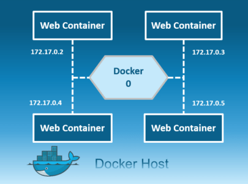
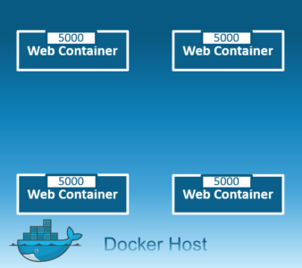
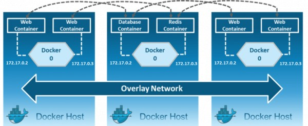
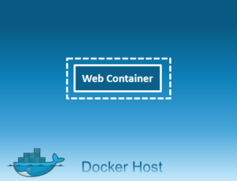
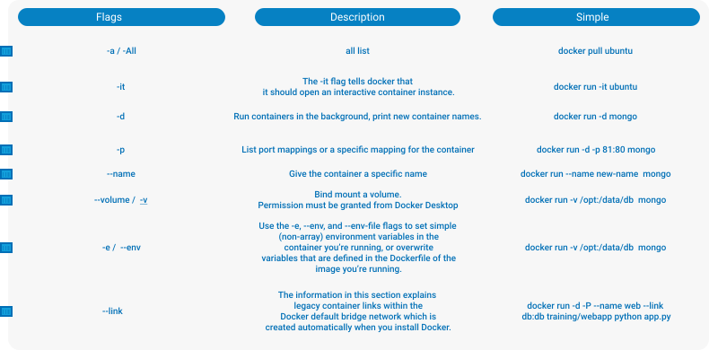

## What is __dockerfile__?
> A Dockerfile is a text document that contains all the commands a user could call on the command line to assemble an image. This page describes the commands you can use in a Dockerfile .

## What is __docker-compose.yml__?
> A docker-compose. yml is a config file for Docker Compose. It allows to deploy, combine, and configure multiple docker containers at the same time. The Docker "rule" is to outsource every single process to its own Docker container.


## Why We Use __Port Mapping__
> Port mapping is used to access the services running inside a Docker container. We open a host port to give us access to a corresponding open port inside the Docker container. Then all the requests that are made to the host port can be redirected into the Docker container.

> Port mapping makes the processes inside the container available from the outside.

> While running a new Docker container, we can assign the port mapping in the docker run command using the -p option:

```powershell
docker run -d -p 81:80 --name httpd-container httpd
```
> The above command launches an httpd container and maps the host’s port 81 to port 80 inside that container.

> By default, the httpd server listens on port 80.

> So, we can now access the application using port 81 on the host machine:

## Docker’s networking subsystem is pluggable using drivers

### Bridge:

 > The default network driver. If you don’t specify a driver, this is the type of network you are creating. Bridge networks are usually used when your applications run in standalone containers that need to communicate. 



### Host: 

> For standalone containers, remove network isolation between the container and the Docker host, and use the host’s networking directly. host is only available for swarm services on Docker 17.06 and higher. 



### Overlay: 

> Overlay networks connect multiple Docker daemons together and enable swarm services to communicate with each other. You can also use overlay networks to facilitate communication between a swarm service and a standalone container, or between two standalone containers on different Docker daemons. This strategy removes the need to do OS-level routing between these containers.



### None: 

> For this container, disable all networking. Usually used in conjunction with a custom network driver. none is not available for swarm services.



# Usefull Commands


# Usefull Flags

